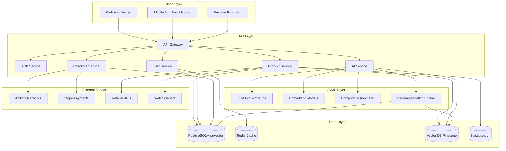

# GiftOS: AI-Powered Universal Gift Commerce Platform

## Executive Summary

Based on comprehensive market research of 2026 e-commerce trends, we'll build **GiftOS** - a gift-first "store of stores" platform that combines Pinterest-like discovery with intelligent gift coordination and multi-store checkout routing. The platform will differentiate through AI-powered features while avoiding the pitfalls that caused previous "universal cart" attempts to fail.

## Market Context & Strategic Positioning

### What Works (Proven Patterns)

- **Universal wishlists/registries**: MyRegistry (213M+ gifts added), Giftster (3M+ members)
- **Affiliate monetization**: Pinterest, Honey, Capital One Shopping (all profitable at scale)
- **Gift-specific mechanics**: Purchase marking, duplicate avoidance, group gifting
- **Browser extensions**: Proven capture mechanism for cross-store saving

### What Doesn't Work

- **Universal checkout without merchant buy-in**: Keep/OneCart failed due to manual fulfillment overhead
- **Competing with Amazon directly**: Amazon is already the universal cart for commodity goods
- **Ignoring affiliate disclosure**: FTC requires clear, conspicuous relationship disclosures

### Our Wedge: Gift Coordination + AI

Position as the **operating system for gifting** rather than just another shopping tool. Focus on:

- **Recipient-centric organization** (not just "things I like")
- **Occasion intelligence** (birthdays, holidays, weddings, etc.)
- **Coordination mechanics** (avoid duplicates, group contributions, privacy)
- **AI-powered discovery** (visual search, conversational recommendations, taste profiles)

## 2026 AI Trends We'll Leverage

### 1. Agentic Commerce (High Priority)

- **Trend**: 25% of consumers have made AI-assisted purchases; 29% plan to in 2026
- **Our Implementation**: Conversational gift advisor that asks clarifying questions, researches products, builds buyer's guides
- **Tech**: GPT-4/Claude integration with RAG for product knowledge

### 2. Visual Search (Medium Priority)

- **Trend**: Google Lens handles 20B monthly searches (4B shopping-related); 70% YoY growth
- **Our Implementation**: "Find gifts like this" - upload inspiration images to discover similar products
- **Tech**: Computer vision embeddings + vector similarity search

### 3. Personalized Recommendations (High Priority)

- **Trend**: AI personalization drives 15-25% higher conversion rates
- **Our Implementation**: Recipient taste profiles, occasion-aware suggestions, collaborative filtering
- **Tech**: Vector embeddings, user behavior tracking, ML recommendation engine

### 4. Sentiment Analysis (Medium Priority)

- **Trend**: 85% of customers trust reviews; 70% of purchases are emotion-driven
- **Our Implementation**: AI-summarized review insights, "gift-worthiness" scoring
- **Tech**: NLP sentiment analysis on aggregated reviews

### 5. Social Commerce Integration (Low Priority - Phase 2)

- **Trend**: TikTok Shop $20B projected; 40% of Gen Z start searches on TikTok
- **Our Implementation**: Import from social platforms, creator gift guides
- **Tech**: Platform APIs, content scraping

## Core User Stories (stories/ folder structure)

### Epic 1: Discovery & Capture

**stories/01-discovery/**

#### Story 1.1: Visual Product Search

```
AS A gift giver
I WANT TO upload an inspiration photo
SO THAT I can find similar products across multiple stores

Acceptance Criteria:
- Upload image or paste URL
- AI identifies products in image
- Returns visually similar items from 10+ retailers
- Can filter by price, category, occasion
- Save results to wishlist with one click

AI Components:
- Computer vision model (ResNet/CLIP embeddings)
- Vector similarity search (Pinecone/Milvus)
- Product catalog with image embeddings
```

#### Story 1.2: Conversational Gift Advisor

```
AS A gift giver who's stuck
I WANT TO chat with an AI advisor
SO THAT I get personalized gift recommendations

Acceptance Criteria:
- Natural language chat interface
- Asks clarifying questions (budget, interests, occasion, relationship)
- Researches current products and prices
- Presents 3-5 curated recommendations with rationale
- Can refine based on feedback ("more like this", "not interested")
- Saves conversation context for future sessions

AI Components:
- LLM integration (GPT-4/Claude API)
- RAG with product knowledge base
- Conversation memory/context management
- Structured output for product cards
```

#### Story 1.3: Browser Extension - Universal Capture

```
AS A user browsing any online store
I WANT TO save products with one click
SO THAT I can build wishlists across all stores

Acceptance Criteria:
- Chrome/Firefox/Safari extension
- Detects product pages automatically
- One-click "Add to GiftOS" button
- Extracts: title, price, images, variants, availability
- Assigns to recipient/occasion
- Works on 1000+ major retailers

Technical:
- DOM scraping with fallback patterns
- Structured data extraction (JSON-LD, microdata)
- Background sync to cloud
- Affiliate link wrapping
```

#### Story 1.4: Mobile Share Sheet Integration

```
AS A mobile user
I WANT TO share products from any app
SO THAT I can save gifts on the go

Acceptance Criteria:
- iOS/Android share sheet extension
- Works from Instagram, TikTok, Safari, Chrome, retail apps
- Same extraction as browser extension
- Offline queue with sync

Technical:
- iOS Share Extension target
- Android Intent Filter
- Mobile-optimized scraping
```

### Epic 2: Organization & Intelligence

**stories/02-organization/**

#### Story 2.1: Recipient Profiles with Taste AI

```
AS A gift giver
I WANT TO build profiles for people I buy gifts for
SO THAT I get better recommendations over time

Acceptance Criteria:
- Create recipient profiles (name, relationship, birthday, sizes)
- Tag saved items by recipient
- AI learns taste preferences from saved items
- "Things they'd love" auto-suggestions
- Import from social media (optional)
- Privacy controls (private by default)

AI Components:
- Collaborative filtering on saved items
- Taste vector embeddings
- Similarity matching across users
- Preference learning from interactions
```

#### Story 2.2: Occasion Calendar & Smart Reminders

```
AS A user
I WANT TO track important gift occasions
SO THAT I never miss a birthday or holiday

Acceptance Criteria:
- Calendar view of upcoming occasions
- Auto-detect from contacts (birthdays)
- Custom occasions (anniversary, graduation, etc.)
- Smart reminders (2 weeks, 1 week, 3 days before)
- Shipping deadline warnings
- Budget tracking per occasion

AI Components:
- Contact integration with permission
- NLP for occasion detection from messages (opt-in)
- Delivery time prediction based on location
```

#### Story 2.3: AI-Powered Gift Boards (Pinterest-like)

```
AS A user
I WANT TO organize gifts into visual boards
SO THAT I can plan themed gifts or events

Acceptance Criteria:
- Create unlimited boards (e.g., "Mom's 60th", "Wedding Registry")
- Drag-and-drop products
- Board cover images and descriptions
- Share boards publicly or privately
- Collaborative boards (multiple editors)
- AI suggests board organization

AI Components:
- Auto-categorization of saved items
- Theme detection (e.g., "kitchen", "outdoor", "tech")
- Duplicate detection across boards
```

### Epic 3: Coordination & Social

**stories/03-coordination/**

#### Story 3.1: Group Gifting with Split Payments

```
AS A group of friends
WE WANT TO chip in for an expensive gift
SO THAT we can give something meaningful together

Acceptance Criteria:
- Create group gift campaign for any item
- Invite contributors via link/email
- Set contribution amounts or let people choose
- Real-time progress tracking
- Payment via Stripe Connect
- Funds released when goal met or deadline passes
- 5-8% platform fee (industry standard)

Technical:
- Stripe Connect for split payments
- Escrow account management
- Refund handling
- Email notifications
```

#### Story 3.2: Purchase Marking & Duplicate Prevention

```
AS A gift giver in a family group
I WANT TO mark items as "claimed" secretly
SO THAT others don't buy the same gift

Acceptance Criteria:
- "I'm buying this" button (hidden from recipient)
- Shows as "claimed" to other group members
- Option to unclaim if plans change
- Recipient never sees claim status
- Works across all stores

Technical:
- Permission-based visibility rules
- Real-time sync across users
- Privacy-preserving state management
```

#### Story 3.3: Shared Family/Friend Wishlists

```
AS A family member
I WANT TO see everyone's wishlists in one place
SO THAT gift-giving is easier year-round

Acceptance Criteria:
- Create family/friend groups
- Invite members via email/link
- See all group members' wishlists
- Filter by person, occasion, price range
- Notification when someone adds to their list
- Privacy: can hide specific items from group

Technical:
- Multi-tenant group architecture
- Granular permission system
- Activity feed with privacy filters
```

### Epic 4: Checkout & Fulfillment

**stories/04-checkout/**

#### Story 4.1: Multi-Store Cart Routing (MVP)

```
AS A user ready to buy
I WANT TO checkout efficiently across multiple stores
SO THAT I don't have to manually visit each site

Acceptance Criteria:
- "Ready to Buy" view groups items by merchant
- One-click opens each merchant's cart
- Affiliate tracking on all links
- Price/availability check before checkout
- Coupon auto-discovery (Honey-style)
- Order tracking after purchase

Technical:
- Affiliate network integration (Rakuten, CJ, ShareASale)
- Deep linking to merchant carts (where possible)
- Real-time price/availability API calls
- Coupon database integration
```

#### Story 4.2: Price Drop Alerts & Smart Timing

```
AS A user
I WANT TO be notified when prices drop
SO THAT I can buy at the best time

Acceptance Criteria:
- Auto-track all saved items
- Email/push when price drops >10%
- Historical price chart
- AI predicts best time to buy
- "Deal alert" badges on items

AI Components:
- Price prediction ML model
- Demand forecasting
- Seasonal pattern detection
- 75%+ accuracy target (industry benchmark)
```

#### Story 4.3: Integrated Checkout (Phase 2 - Select Partners)

```
AS A user (future phase)
I WANT TO checkout once for multiple stores
SO THAT buying is frictionless

Acceptance Criteria:
- Single payment form for participating merchants
- Stored payment/shipping info
- Order confirmation from each merchant
- Unified order tracking
- Returns handled per merchant policy

Technical:
- Merchant API integrations (Shopify partners first)
- Payment orchestration
- Fulfillment coordination
- Customer support escalation
```

### Epic 5: AI-Enhanced Features

**stories/05-ai-features/**

#### Story 5.1: Review Intelligence & Gift-Worthiness Scoring

```
AS A gift giver
I WANT TO understand if a product makes a good gift
SO THAT I avoid disappointment

Acceptance Criteria:
- AI-summarized review insights
- "Gift-worthiness" score (1-10)
- Key pros/cons extraction
- Common complaints highlighted
- Sentiment trend over time
- "People say this is perfect for..." tags

AI Components:
- Sentiment analysis (NLP)
- Review summarization (LLM)
- Entity extraction (occasions, use cases)
- Aggregate scoring algorithm
```

#### Story 5.2: Occasion-Aware Recommendations

```
AS A user
I WANT TO see gift suggestions for upcoming occasions
SO THAT I'm inspired and prepared

Acceptance Criteria:
- Homepage shows "Gifts for [Occasion] in [X] days"
- Personalized to recipient taste profile
- Budget-aware suggestions
- Trending gifts for that occasion
- "Others also bought" for similar recipients

AI Components:
- Collaborative filtering
- Occasion-specific training data
- Trend detection algorithm
- Personalization engine
```

#### Story 5.3: Natural Language Search

```
AS A user
I WANT TO search using natural descriptions
SO THAT I can find gifts without knowing exact terms

Acceptance Criteria:
- Search like "something cozy for my mom who loves reading"
- AI interprets intent and preferences
- Returns relevant products across categories
- Can refine with follow-up queries
- Search history for inspiration

AI Components:
- Semantic search (embeddings)
- Query understanding (LLM)
- Vector similarity on product catalog
- Contextual re-ranking
```

### Epic 6: Platform & Infrastructure

**stories/06-platform/**

#### Story 6.1: Product Catalog & Data Pipeline

```
AS THE SYSTEM
I NEED a comprehensive product database
SO THAT all features have accurate data

Technical Requirements:
- Scrape/API from 1000+ retailers
- Normalize product data (title, price, images, specs)
- Generate embeddings for visual/semantic search
- Real-time availability checking
- Price history tracking
- Affiliate link management
- Broken link detection & cleanup

Tech Stack:
- PostgreSQL with pgvector extension
- Redis for caching
- Celery for background jobs
- BeautifulSoup/Playwright for scraping
- OpenAI/Anthropic for embeddings
```

#### Story 6.2: Analytics & Insights Dashboard

```
AS A user
I WANT TO see my gifting patterns
SO THAT I can budget and plan better

Acceptance Criteria:
- Annual spending by recipient/occasion
- Most popular categories
- Average gift price
- On-time vs. last-minute purchases
- Saved vs. spent comparison
- Gift success rate (if feedback enabled)

Technical:
- Event tracking (Mixpanel/Amplitude)
- Data warehouse (BigQuery/Snowflake)
- Visualization (Recharts/D3)
```

#### Story 6.3: Compliance & Trust

```
AS THE PLATFORM
I MUST comply with regulations
SO THAT we operate legally and ethically

Requirements:
- FTC affiliate disclosure (clear & conspicuous)
- GDPR/CCPA data privacy compliance
- PCI DSS for payment data (via Stripe)
- Terms of Service & Privacy Policy
- Cookie consent management
- Accessibility (WCAG 2.1 AA)
- Content moderation for user-generated content

Technical:
- Disclosure UI components
- Data retention policies
- Encryption at rest & in transit
- Audit logging
```

## Technology Stack Recommendations

### Frontend

- **Web**: Next.js 14+ (App Router), React, TypeScript, Tailwind CSS
- **Mobile**: React Native or Flutter (cross-platform)
- **Extension**: Plasmo framework (modern extension development)
- **State**: Zustand or Jotai (lightweight, performant)

### Backend

- **API**: Node.js/Express or Python/FastAPI
- **Database**: PostgreSQL with pgvector for embeddings
- **Cache**: Redis for sessions, rate limiting, real-time data
- **Search**: Elasticsearch or Typesense for text search
- **Vector DB**: Pinecone, Milvus, or Weaviate for AI features
- **Queue**: BullMQ or Celery for background jobs

### AI/ML

- **LLM**: OpenAI GPT-4 or Anthropic Claude (API)
- **Embeddings**: OpenAI text-embedding-3, CLIP for images
- **Computer Vision**: Hugging Face Transformers (ResNet, CLIP)
- **ML Ops**: Modal or Replicate for model serving
- **Vector Search**: Pinecone or self-hosted Milvus

### Infrastructure

- **Hosting**: Vercel (frontend), Railway/Render (backend)
- **CDN**: Cloudflare for images and static assets
- **Storage**: S3 or Cloudflare R2 for user uploads
- **Monitoring**: Sentry (errors), Datadog (APM)
- **Analytics**: PostHog or Mixpanel

### Payments & Commerce

- **Payments**: Stripe Connect for group gifting
- **Affiliates**: Rakuten, CJ Affiliate, ShareASale, Amazon Associates
- **Email**: Resend or SendGrid
- **SMS**: Twilio for reminders

## Monetization Strategy

### Phase 1: Affiliate Revenue

- 3-10% commission on purchases (industry standard)
- No cost to users
- Transparent disclosure required

### Phase 2: Premium Features ($9.99/month)

- Unlimited price tracking
- Advanced AI recommendations
- Priority customer support
- Ad-free experience
- Early access to new features

### Phase 3: Group Gifting Fees

- 5-8% platform fee on group gifts (industry standard)
- Covers payment processing + platform costs

### Phase 4: B2B Corporate Gifting

- White-label solution for companies
- Bulk ordering and management
- Custom branding
- API access

## Phased Rollout Plan

### Phase 1: MVP (Months 1-3)

- Browser extension with basic capture
- Recipient profiles and wishlists
- Multi-store cart routing (affiliate links)
- Basic search and filtering
- Mobile-responsive web app

### Phase 2: AI Core (Months 4-6)

- Conversational gift advisor
- Visual search
- Personalized recommendations
- Price drop alerts
- Review intelligence

### Phase 3: Social & Coordination (Months 7-9)

- Group gifting with payments
- Shared family wishlists
- Purchase marking and duplicate prevention
- Occasion calendar and reminders

### Phase 4: Advanced Features (Months 10-12)

- Mobile apps (iOS/Android)
- Integrated checkout (select partners)
- Social commerce integration
- Creator tools and gift guides
- B2B corporate features

## Success Metrics

### User Acquisition

- 10K users in first 3 months
- 100K users by month 12
- 30% month-over-month growth

### Engagement

- 3+ items saved per user per month
- 40% monthly active user rate
- 15 min average session time

### Monetization

- $50 average order value (AOV)
- 5% conversion rate (saves to purchases)
- $15 revenue per user per year

### AI Performance

- 85%+ recommendation acceptance rate
- 75%+ price prediction accuracy
- <2s response time for AI features

## Risk Mitigation

### Technical Risks

- **Scraping reliability**: Multi-strategy approach (APIs > structured data > scraping)
- **AI costs**: Cache embeddings, use smaller models where possible, implement rate limits
- **Scale**: Start with managed services, optimize later

### Business Risks

- **Merchant pushback**: Position as traffic driver, not competitor
- **Affiliate approval**: Apply to networks early, build track record
- **User trust**: Transparent disclosures, strong privacy controls

### Competitive Risks

- **Pinterest/Amazon entry**: Focus on gift coordination (not just discovery)
- **Honey/Karma**: Differentiate on recipient-centric UX
- **Registry platforms**: Add AI and broader use cases

## File Structure for Stories

```
stories/
├── 01-discovery/
│   ├── 1.1-visual-search.md
│   ├── 1.2-conversational-advisor.md
│   ├── 1.3-browser-extension.md
│   └── 1.4-mobile-share.md
├── 02-organization/
│   ├── 2.1-recipient-profiles.md
│   ├── 2.2-occasion-calendar.md
│   └── 2.3-gift-boards.md
├── 03-coordination/
│   ├── 3.1-group-gifting.md
│   ├── 3.2-purchase-marking.md
│   └── 3.3-shared-wishlists.md
├── 04-checkout/
│   ├── 4.1-cart-routing.md
│   ├── 4.2-price-alerts.md
│   └── 4.3-integrated-checkout.md
├── 05-ai-features/
│   ├── 5.1-review-intelligence.md
│   ├── 5.2-occasion-recommendations.md
│   └── 5.3-natural-language-search.md
├── 06-platform/
│   ├── 6.1-product-catalog.md
│   ├── 6.2-analytics-dashboard.md
│   └── 6.3-compliance-trust.md
├── research/
│   ├── market-analysis.md
│   ├── competitor-landscape.md
│   ├── ai-trends-2026.md
│   └── technical-feasibility.md
└── README.md
```

## Next Steps

1. **Validate assumptions**: User interviews with target gift-givers
2. **Technical spike**: Test scraping reliability on top 20 retailers
3. **AI prototyping**: Build conversational advisor proof-of-concept
4. **Design system**: Create component library and design tokens
5. **MVP scoping**: Finalize Phase 1 features based on user feedback

## Architecture Diagram




This comprehensive plan leverages cutting-edge 2026 AI trends while learning from past failures in universal commerce. The gift-first positioning provides a defensible wedge, and the phased approach allows for validation and iteration.